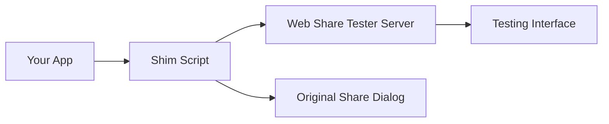

# Web Share API Tester

[](https://badge.fury.io/js/web-share-tester)
[](https://opensource.org/licenses/MIT)
[](https://github.com/popidge/web-share-tester/actions)

An interactive dev tool for testing Web Share API implementations with realistic platform mockups and live interception capabilities.


## ✨ Features

### 🎯 Manual Testing Mode
- **Platform Mockups**: Realistic share dialogs for iOS, Android, macOS, Windows using devices.css
- **Share Target Apps**: Messages, Mail, Twitter, WhatsApp with authentic UI styling
- **Interactive Flow**: Click share targets in sender view to jump to receiver view
- **Real-time Updates**: Form changes instantly reflect across all mockups

### 🔴 Live Interception Mode  
- **WebSocket Integration**: Real-time connection to testing server
- **Automatic Capture**: Intercepts `navigator.share()` calls from any page with shim script
- **Live Updates**: Testing interface updates immediately when shares are intercepted
- **Dev-focused**: By default, only sends to tester (no OS share dialog)
- **Runtime Configuration**: Toggle original share functionality as needed

### 🎨 Modern Design
- **Glassmorphism UI**: Beautiful backdrop-filter effects and gradients
- **Responsive Design**: Works on desktop, tablet, and mobile
- **Dark/Light Themes**: Automatic theme adaptation
- **Smooth Animations**: Polished interactions and transitions

## 🚀 Quick Start

### Installation

```bash
npm install web-share-tester --save-dev
```

### Two Ways to Use This Tool

#### Option A: Standalone Testing (No Integration Required)
Perfect for exploring Web Share API behavior and designing share flows:

```bash
npx web-share-tester
# Opens testing interface at http://localhost:3001
```

#### Option B: Live Integration Testing
Test real Web Share API calls from your existing development app:

```bash
# Terminal 1: Start your existing dev server
npm run dev  # Your app (e.g., React, Vue, etc.) on localhost:3000

# Terminal 2: Start Web Share Tester
npx web-share-tester  # Tester on localhost:3001
```

Then **manually add** the shim script to your app's HTML:
```html
<!-- Add this script tag to your development app -->
<script src="http://localhost:3001/web-share-tester-shim.js"></script>
```

Now your app's `navigator.share()` calls will appear in the tester interface!

## 📖 Usage Examples

### Manual Testing

Perfect for designing and testing share workflows:

1. Open http://localhost:3001
2. Select a platform (iOS, Android, macOS, Windows)  
3. Enter share data (title, text, URL)
4. View realistic platform share dialogs
5. Click share target apps to see receiver mockups
6. Switch between sender and receiver views

### Live Testing with Your App

**Important**: Interception requires **manual integration** - it's not automatic!

#### Step-by-Step Integration

1. **Start both servers:**
   ```bash
   # Terminal 1: Your existing development server
   cd my-app
   npm run dev  # Running on localhost:3000
   
   # Terminal 2: Web Share Tester
   npx web-share-tester  # Running on localhost:3001
   ```

2. **Add the shim script to your app:**
   ```html
   <!DOCTYPE html>
   <html>
   <head>
       <!-- Add this script BEFORE your app's JavaScript -->
       <script src="http://localhost:3001/web-share-tester-shim.js"></script>
   </head>
   <body>
       <button onclick="shareContent()">Share</button>
       
       <script>
       async function shareContent() {
           try {
               // This call will now be intercepted and displayed in the tester!
               await navigator.share({
                   title: 'My App',
                   text: 'Check out this awesome content!',
                   url: 'https://myapp.com/content'
               });
           } catch (error) {
               console.error('Share failed:', error);
           }
       }
       </script>
   </body>
   </html>
   ```

3. **Watch the magic happen:**
   - Click "Share" in your app (localhost:3000)
   - See the data appear in the tester interface (localhost:3001)
   - No OS share dialog appears by default (dev-focused testing)

#### How the Interception Works

The shim script **replaces** `navigator.share()` in your browser with a version that:
- ✅ Sends share data to the Web Share Tester via HTTP
- ✅ Validates data according to Web Share API spec  
- ✅ Optionally triggers the original OS share dialog (configurable)
- ✅ Works as a polyfill if Web Share API isn't supported

### Runtime Configuration

Control the interceptor behavior from your browser console:

```javascript
// Enable/disable original OS share dialog
window.webShareTester.enableOriginalShare(true)  // Both tester + OS  
window.webShareTester.enableOriginalShare(false) // Only tester (default)

// Toggle debug logging
window.webShareTester.enableDebug(true)

// View current configuration  
window.webShareTester.getConfig()

// Test share with current settings
window.webShareTester.testShare({ 
    title: 'Test', 
    text: 'Testing the share functionality...' 
})
```

## 📱 Supported Platforms

| Platform | Share Dialog | Receiver Apps |
|----------|--------------|---------------|
| **iOS** | Native iOS share sheet with blur effects | Messages, Mail, Twitter, WhatsApp |
| **Android** | Material Design share bottom sheet | Native Android app styling |  
| **macOS** | macOS modal dialog with window controls | Desktop app interfaces |
| **Windows** | Windows share dialog with system styling | Windows app mockups |

## 🔍 How It Works

### Architecture Overview

Web Share API Tester uses a **client-side interception** approach rather than network-level routing:



### What Happens When You Add the Shim

1. **Script Loading**: The shim script loads and runs in your app's browser context
2. **API Replacement**: `navigator.share()` gets replaced with an intercepting version
3. **Data Capture**: When your app calls `navigator.share()`, the data is captured
4. **Dual Action**: Data is sent to the tester AND optionally to the OS (configurable)
5. **Live Updates**: The tester interface updates in real-time via WebSocket

### What Does NOT Happen

❌ **No automatic interception** of all Web Share API calls on your system  
❌ **No network-level routing** or traffic interception  
❌ **No modification** of your development server  
❌ **No system-wide hooks** or background processes  

### What DOES Happen

✅ **Manual integration** via a simple script tag  
✅ **Client-side replacement** of the Web Share API function  
✅ **Configurable behavior** (tester-only vs. tester + OS share)  
✅ **Development-focused** experience with detailed logging

## 🛠️ API Reference

### Server Endpoints

- `GET /` - Main testing interface
- `GET /test` - Simple test application  
- `GET /web-share-tester-shim.js` - Client interceptor script
- `POST /api/share` - Receive intercepted share data
- `GET /api/health` - Server health check
- `WebSocket /` - Real-time communication

### Configuration Options

```javascript
const CONFIG = {
    serverPort: 3001,           // Server port (auto-detected)
    enableOriginalShare: false, // Send to OS share dialog  
    debug: true                 // Console logging
}
```

## 🔧 Development

### Available Scripts

```bash
npm run dev              # Start Vite dev server for interface development
npm run build            # Build the testing interface  
npm run start            # Build and start production server
npm run server           # Start server (requires pre-built dist/)
npm run test:integration # Run both dev and server concurrently
```

### Project Structure

```
├── src/                    # Preact testing interface
│   ├── app.jsx            # Main application component
│   ├── app.css            # Glassmorphism styling  
│   └── components/        # Platform mockup components
├── server/                 # Express server with WebSocket support
│   ├── index.js           # Main server with API endpoints
│   └── client-shim.js     # Web Share API interceptor script
├── plugins/               # Build tool integrations  
│   └── vite-plugin-web-share-tester.js
├── test/                  # Test applications
│   └── test-app.html      # Simple test page
└── dist/                  # Built interface (created by npm run build)
```

## 🎮 Advanced Usage

### Custom Server Port

```javascript
// Set custom port via environment variable
PORT=8080 npx web-share-tester

// Or programmatically 
const { WebShareTesterServer } = require('web-share-tester/server');
const server = new WebShareTesterServer({ port: 8080 });
await server.start();
```

### Integration with Build Tools

```javascript
// vite.config.js example
import { defineConfig } from 'vite'
import webShareTester from 'web-share-tester/plugins/vite-plugin-web-share-tester'

export default defineConfig({
  plugins: [
    webShareTester({
      port: 3001,
      autoStart: true
    })
  ]
})
```

## 🐛 Troubleshooting

### Common Issues

**❓ "Why aren't my shares being intercepted?"**
- **Check**: Did you add the shim script to your app's HTML?
  ```html
  <script src="http://localhost:3001/web-share-tester-shim.js"></script>
  ```
- **Check**: Is the shim script loading BEFORE your share code?
- **Check**: Are both servers running (your app + Web Share Tester)?
- **Remember**: Interception is NOT automatic - it requires manual integration!

**❓ "I ran `npx web-share-tester` but my app's shares aren't showing up"**
- This is expected! The tester doesn't automatically capture all shares on your system
- You need to manually add the shim script to your development app
- See the "Live Testing with Your App" section above

**WebSocket connection failed:**
- Check if port 3001 is available
- Verify firewall settings  
- Try a different port using `PORT=8080 npx web-share-tester`

**Share interception not working:**
- Ensure the shim script loads before your share code
- Check browser console for any errors (look for Web Share Tester logs)
- Verify the testing server is running
- Try the test page at http://localhost:3001/test to verify the server works

**Platform mockups not displaying:**
- Ensure you have a stable internet connection (devices.css loads externally)
- Check browser developer tools for CSS loading errors
- Try refreshing the page

**❓ "Can I use this in production?"**
- No! This is a development tool only
- Never include the shim script in production builds
- Use conditional loading for development only:
  ```html
  <script>
  if (location.hostname === 'localhost' || location.hostname === '127.0.0.1') {
    document.write('<script src="http://localhost:3001/web-share-tester-shim.js"><\/script>');
  }
  </script>
  ```

## 🤝 Contributing

We welcome contributions! Please see our [Contributing Guide](CONTRIBUTING.md) for details.

### Development Setup

1. Fork and clone the repository
2. Install dependencies: `npm install`
3. Start development server: `npm run dev`
4. Start testing server: `npm run server` (in another terminal)
5. Make your changes and test thoroughly
6. Submit a pull request

## 📋 Roadmap

### v2.0 (Planned)
- **File Sharing Support**: Handle `files` property of Web Share API
- **File Type Validation**: Comprehensive MIME type checking
- **File Previews**: Thumbnail generation for images, type icons for others  
- **Enhanced Mockups**: File attachment UIs for all platforms

### Future Enhancements
- **Custom Themes**: User-defined color schemes
- **Export Functionality**: Save test scenarios and share data
- **Plugin System**: Extensible architecture for custom platforms
- **Performance Monitoring**: Share API performance metrics

## 📄 License

This project is licensed under the MIT License - see the [LICENSE](LICENSE) file for details.

## 🙏 Acknowledgments

- [devices.css](https://github.com/picturepan2/devices.css) for beautiful device mockups
- [Preact](https://preactjs.com/) for the lightweight React alternative
- [Vite](https://vitejs.dev/) for the lightning-fast build tool
- The Web Share API specification and community

---

**Made with ❤️ for the web development community**

If this tool helped you, please consider [starring the repository](https://github.com/popidge/web-share-tester) and sharing it with others!